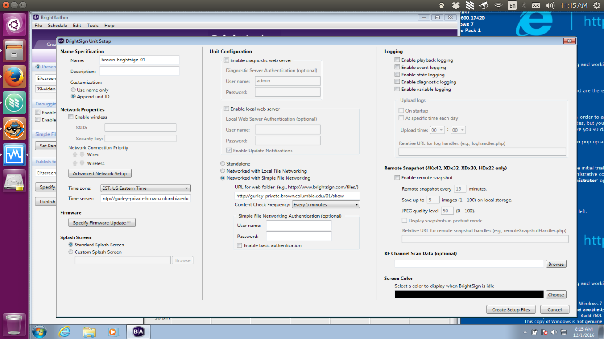
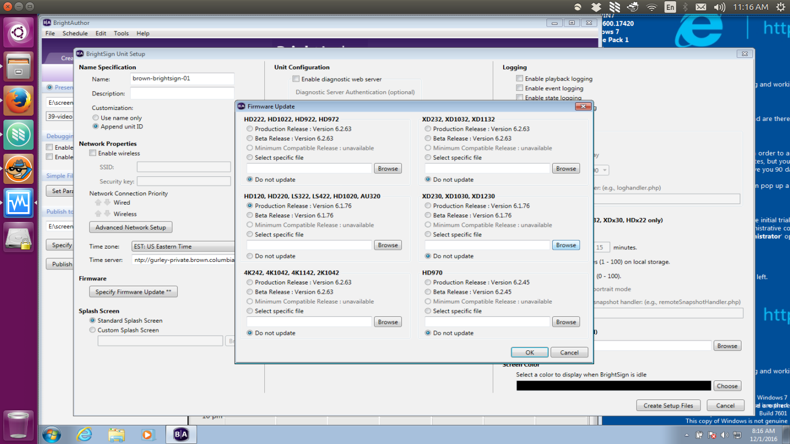

This directory contains directories `00-50`, each corresponding to the SD Card for each BrightSign unit.

# Instructions
For generating cards from template:

1. unzip `originals/template-card.zip` (ensure you don't have a `template-card` directory already)
2. run `python generate-cards.py`
3. Copy each card to appropriate SD Card and label it so you don't lose it

Just be sure not to recommit the cards to git. Contains empty folders. Empty folders are necessary for SD Cards & shows to maintain directory structure and integrity.

# Settings
```
Name Specification:
  Name: brown-brightsign-[01-50]
  Description: <blank>
  Customization:
  * [ ] Use name only
  * [x] Append unit ID

Network Properties:
  [ ] Enable Wireless <keep default: off>

  Network Connection Priority: <keep default order>
    Wired
    Wireless

  Advanced Network Setup (BUTTON - keep factory defaults but check at least once)
    Unit Configuration <all off>:
      * [ ] specify hostname
      * [ ] use proxy
    Wired:
      Connection Settings:
        [x] Obtain an IP address automatically
    Diagnostics:
      [ ] Enable network diagnostics


  Time Zone: EST: US Eastern Time <Default>
  Time server: ntp://gurley-priate.brown.columbia.edu <MAKE CHANGE>

Specify Firmware Update (Button):
  ONLY TRIGGER:
    HD120, HD220, LS422, HD1020, AU320
      * [x] Production Release <CHANGE DEFAULT SETTING FOR EACH CARD>
      * [ ] beta Release
      * select specific file
      * [ ] Do Not Update

Splash Screen:
  * [x] Standard Splash Screen <Default>
  * [ ] Custom Splash Screen

Unit Configuration:
  [ ] Enable diagnostic web server <ENSURE THIS IS ABSOLUTELY NOT CHECKED>

  [ ] Enable local web server

  * [ ] Standalone
  * [ ] Networked with Local File Networking
  * [x] Networked with Simple File Networking
    URL for web folder:
      http://gurley-private.brown.columbia.edu/[01-50]/show <NOTE: Do not leave a trailing slash. MUST end with `show`, NOT `show/`>
    Content Check Frequency:
      Every 5 minutes

    [ ] Enable Basic Authorization

Logging:
  * [ ] Enable playback logging
  * [ ] Enable event logging
  * [ ] Enable state logging
  * [ ] Enable diagnostic logging
  * [ ] Enable variable logging

  Upload Logs:
    * [ ] On Startup
    * [ ] At Specific Time of Day

Remote Snapshot:
 [ ] Enable Remote Snapshot

 -> Create Setup Files & save to new folder for each card
 (e.g /brightsign-brown-shows/cards/01)
 ```

Card Settings - Main:


Card Settings: Specify Firmware Update

